# Chapter 5: Architectural Design

This chapter presents the architectural design of the implemented pattern recognition system for antimicrobial resistance (AMR) within the Water–Fish–Human nexus. The architecture described in this chapter corresponds to a fully implemented and operational system, rather than a conceptual or proposed design.

The system processes antimicrobial susceptibility testing (AST) data from 491 bacterial isolates comprising six species: _Escherichia coli_ (46.2%), _Klebsiella pneumoniae_ (30.3%), _Enterobacter cloacae_ (13.8%), _Enterobacter aerogenes_ (4.7%), _Salmonella_ spp. (4.7%), and _Vibrio vulnificus_ (0.2%), collected across environmental (water, fish) and clinical sample sources from three Philippine regions (BARMM, Central Luzon, Eastern Visayas). Environmental and regional metadata are preserved throughout the pipeline but are intentionally excluded from analytical computations to ensure unbiased pattern discovery.

---

## Architectural Design Goals

The architecture was guided by five primary design goals that reflect both software engineering best practices and methodological requirements specific to machine learning workflows.

| Design Goal              | Description                                                                                |
| ------------------------ | ------------------------------------------------------------------------------------------ |
| **Modularity**           | Loosely coupled components with clear responsibilities; independent replacement capability |
| **Reproducibility**      | Centralized configuration, fixed random seeds (RANDOM_STATE=42), artifact persistence      |
| **Leakage Prevention**   | Train-test separation, feature-metadata boundary, fit-on-train only                        |
| **Interpretability**     | Traceable assignments, feature importance, metadata post-hoc only                          |
| **Experimental Control** | Single config source, systematic comparison, baseline consistency                          |

### Modularity

The system is decomposed into discrete, loosely coupled components with clearly defined responsibilities. Each module can be modified or replaced without affecting unrelated parts of the pipeline. For example, alternative clustering strategies can be introduced without modifying data ingestion or visualization logic.

### Reproducibility

Reproducibility is ensured through:

- Centralized configuration of all parameters (`config.py`)
- Fixed random seeds for stochastic processes (RANDOM_STATE = 42)
- Persistence of intermediate artifacts at every transformation stage

### Leakage Prevention

The architecture enforces strict separation between training and evaluation data. Train–test splitting occurs before any preprocessing steps, and all preprocessing parameters are learned exclusively from training data. This separation is enforced structurally through module boundaries.

### Interpretability

Interpretability is supported by:

- Traceable cluster assignments
- Explicit feature importance extraction
- Separation between pattern discovery and domain interpretation

Metadata is intentionally excluded from clustering and validation processes and is introduced only during post-hoc visualization.

### Experimental Control

All experimental parameters are defined in a centralized configuration module, enabling systematic comparison of alternative settings while maintaining consistent baselines.

---

## Overall Architecture Style

The system adopts a **layered architectural style**, consisting of a Data Layer, Analysis Layer, and Presentation Layer. This structure mirrors the methodological progression from data preprocessing to pattern discovery and interpretation.

| Layer                  | Components                                                                  | Data Flow                  |
| ---------------------- | --------------------------------------------------------------------------- | -------------------------- |
| **Presentation Layer** | Static Visualizations, Interactive Dashboard, PCA Projections               | Outputs to user            |
| **Analysis Layer**     | Hierarchical Clustering, Supervised Validation, Statistical Analysis        | Processes feature matrices |
| **Data Layer**         | Data Ingestion, Quality Filtering, Resistance Encoding, Feature Engineering | Receives raw AST data      |

Layered architecture was selected because it:

- Naturally aligns with sequential ML workflows
- Enforces separation of concerns
- Prevents circular dependencies
- Provides clear validation boundaries between phases

---

### 1. Pattern Recognition System Architecture

The pattern recognition architecture establishes the complete end-to-end workflow from raw surveillance data to actionable clinical insights, operationalizing the methodology described in Chapter 4.

**Figure 1: Pattern Recognition System Architecture**

_Caption: Pattern Recognition System Architecture: Integrated workflow from data preprocessing through unsupervised clustering, supervised classification, statistical validation, to interactive visualization. Artifact-based communication ensures reproducibility and modularity._

Figure 1 presents the complete system architecture showing the integration of all methodological components. The architecture employs a sequential pipeline design where each component consumes outputs from the previous operation while producing well-defined artifacts for subsequent processing. Configuration management centralizes hyperparameters, ensuring consistent parameterization across all modules. The dual-output design produces both batch analysis results (CSV, models, statistical reports) and an interactive dashboard for real-time exploration.

---

### 2. Data Preprocessing

The preprocessing architecture transforms raw laboratory AST data into analysis-ready matrices suitable for unsupervised and supervised learning, implementing data integration, quality control, encoding, and feature engineering operations while maintaining provenance and reproducibility.

**Figure 2: Data Preprocessing**

```mermaid
flowchart TB
    subgraph Input["INPUT"]
        RAW["Raw AST Data<br/>━━━━━━━━━━━<br/>Multiple CSV files<br/>(INOHAC Project 2)<br/>BARMM, Region III, Region VIII"]
    end

    subgraph Stage1["Data Ingestion"]
        direction TB
        S1_OP["Operations:<br/>• Schema harmonization<br/>• Column standardization<br/>• Metadata extraction<br/>• Duplicate resolution"]
        S1_OUT["Output:<br/>📄 unified_raw_dataset.csv"]
        S1_OP --> S1_OUT
    end

    subgraph Stage2["Data Cleaning"]
        direction TB
        S2_PARAMS["Quality Thresholds:<br/>━━━━━━━━━━━━━━━<br/>MIN_ANTIBIOTIC_COVERAGE = 70%<br/>MAX_ISOLATE_MISSING = 30%"]
        S2_OP["Operations:<br/>• Antibiotic-level filtering<br/>• Isolate-level filtering<br/>• Quality audit logging"]
        S2_OUT["Outputs:<br/>📄 cleaned_dataset.csv<br/>📄 cleaning_report.txt"]
        S2_PARAMS --> S2_OP
        S2_OP --> S2_OUT
    end

    subgraph Stage3["Resistance Encoding"]
        direction TB
        S3_PARAMS["Encoding Scheme:<br/>━━━━━━━━━━━━━━━<br/>Susceptible (S) → 0<br/>Intermediate (I) → 1<br/>Resistant (R) → 2"]
        S3_OP["Operations:<br/>• Ordinal transformation<br/>• Categorical to numerical<br/>• Median imputation"]
        S3_OUT["Output:<br/>📄 encoded_dataset.csv"]
        S3_PARAMS --> S3_OP
        S3_OP --> S3_OUT
    end

    subgraph Stage4["Feature Engineering"]
        direction TB
        S4_PARAMS["Feature Definitions:<br/>━━━━━━━━━━━━━━━<br/>MAR Index = a/b<br/>Resistant Classes = count<br/>MDR Flag = classes ≥ 3"]
        S4_OP["Operations:<br/>• MAR index computation<br/>• Resistant classes count<br/>• MDR classification<br/>• Feature-Metadata separation"]
        S4_OUT["Outputs:<br/>📄 feature_matrix_X.csv<br/>📄 metadata.csv"]
        S4_PARAMS --> S4_OP
        S4_OP --> S4_OUT
    end

    subgraph Config["Configuration Module"]
        CFG["config.py<br/>━━━━━━━━━━━<br/>RANDOM_STATE = 42<br/>RESISTANCE_ENCODING<br/>ANTIBIOTIC_CLASSES<br/>MDR_MIN_CLASSES = 3"]
    end

    subgraph Output["PREPROCESSED DATA"]
        FEATURES["Feature Matrix (X)<br/>━━━━━━━━━━━━━━━<br/>n_isolates × 22 antibiotics<br/>Ordinal encoded (0/1/2)<br/>Ready for clustering"]
        METADATA["Metadata Matrix (M)<br/>━━━━━━━━━━━━━━━<br/>Region, Environment,<br/>Species, MAR, MDR<br/>For post-hoc analysis"]
    end

    RAW --> Stage1
    S1_OUT --> Stage2
    S2_OUT --> Stage3
    S3_OUT --> Stage4
    S4_OUT --> FEATURES
    S4_OUT --> METADATA

    CFG -.->|"Parameters"| Stage1
    CFG -.->|"Parameters"| Stage2
    CFG -.->|"Parameters"| Stage3
    CFG -.->|"Parameters"| Stage4

    style Input fill:#ffebee,stroke:#c62828,stroke-width:3px
    style RAW fill:#ffcdd2,stroke:#e53935,stroke-width:2px

    style Stage1 fill:#e8f5e9,stroke:#2e7d32,stroke-width:2px
    style S1_OP fill:#c8e6c9,stroke:#388e3c
    style S1_OUT fill:#a5d6a7,stroke:#43a047

    style Stage2 fill:#e8f5e9,stroke:#2e7d32,stroke-width:2px
    style S2_PARAMS fill:#dcedc8,stroke:#689f38
    style S2_OP fill:#c8e6c9,stroke:#388e3c
    style S2_OUT fill:#a5d6a7,stroke:#43a047

    style Stage3 fill:#e8f5e9,stroke:#2e7d32,stroke-width:2px
    style S3_PARAMS fill:#dcedc8,stroke:#689f38
    style S3_OP fill:#c8e6c9,stroke:#388e3c
    style S3_OUT fill:#a5d6a7,stroke:#43a047

    style Stage4 fill:#e8f5e9,stroke:#2e7d32,stroke-width:2px
    style S4_PARAMS fill:#dcedc8,stroke:#689f38
    style S4_OP fill:#c8e6c9,stroke:#388e3c
    style S4_OUT fill:#a5d6a7,stroke:#43a047

    style Config fill:#fff9c4,stroke:#f57f17,stroke-width:2px
    style CFG fill:#fff8e1,stroke:#ff8f00

    style Output fill:#e3f2fd,stroke:#1565c0,stroke-width:3px
    style FEATURES fill:#bbdefb,stroke:#1976d2,stroke-width:2px
    style METADATA fill:#bbdefb,stroke:#1976d2,stroke-width:2px
```

_Caption: Data Preprocessing : Sequential pipeline transforming raw CSV files through unification, cleaning, encoding, and feature engineering to produce analysis-ready datasets. Quality control checkpoints ensure data integrity throughout processing._

Figure 2 illustrates the preprocessing pipeline with four sequential operations:

**Data Ingestion** — Raw CSV files from multiple surveillance sites (BARMM, Region III, Region VIII) are loaded with schema validation. Each file contains isolate records with metadata (collection date, region, facility, species) and AST results for 22 antibiotics. Operations include schema harmonization, column standardization, metadata extraction, and duplicate resolution, producing `unified_raw_dataset.csv`.

**Data Cleaning** — Quality control operations remove isolates with <70% antibiotic coverage (ensuring sufficient data for pattern detection) and flag outliers in numerical metadata. Missing value patterns are analyzed to distinguish Missing Completely At Random (MCAR) from systematic missingness. Cleaning reports document removed records and imputation strategies, producing `cleaned_dataset.csv` and `cleaning_report.txt`.

**Resistance Encoding** — Categorical AST results (S/I/R) are converted to numerical resistance scores using ordinal encoding (0=S, 1=I, 2=R) preserving intermediate resistance states. Missing values are imputed using median resistance per antibiotic (maintaining marginal distributions), producing `encoded_dataset.csv`.

**Feature Engineering** — Derived features are computed including Multiple Antibiotic Resistance (MAR) index (proportion of resistant antibiotics), class-level resistance counts, and MDR classification (≥3 resistant classes per Magiorakos et al., 2012). Metadata (region, species, environment) are separated from resistance features to prevent leakage into clustering, producing `feature_matrix_X.csv` (491 × 22) and `metadata.csv`.

This architecture ensures reproducibility through explicit artifact persistence and maintains data lineage for audit trails.

---

### 3. Unsupervised Learning

The clustering architecture discovers latent resistance patterns through hierarchical agglomerative clustering, implementing similarity-based grouping, optimal cluster selection, validation, and profile characterization without using outcome labels.

**Figure 3: Unsupervised Learning**

```mermaid
flowchart TB
    subgraph Input["INPUT"]
        FEATURES["Feature Matrix (X)<br/>━━━━━━━━━━━━━━━<br/>491 isolates × 22 antibiotics<br/>Ordinal encoded (0/1/2)<br/>From preprocessing"]
    end

    subgraph Stage1["Optimal k Selection"]
        direction TB
        S1_PARAMS["Selection Parameters:<br/>━━━━━━━━━━━━━━━<br/>K_RANGE = 2-10<br/>METHOD = 'combined'<br/>RANDOM_STATE = 42"]
        S1_OP["Operations:<br/>• Compute WCSS for each k<br/>• Calculate Silhouette scores<br/>• Apply elbow detection algorithm<br/>• Select optimal k via combined method"]
        S1_OUT["Output:<br/>📊 cluster_validation.png<br/>📈 Elbow point: k=4"]
        S1_PARAMS --> S1_OP
        S1_OP --> S1_OUT
    end

    subgraph Stage2["Ward's Linkage Clustering"]
        direction TB
        S2_PARAMS["Clustering Parameters:<br/>━━━━━━━━━━━━━━━<br/>Method: Ward's Linkage<br/>Distance: Euclidean<br/>Optimal k: 4 (data-driven)<br/>RANDOM_STATE = 42"]
        S2_OP["Operations:<br/>• Compute distance matrix<br/>• Apply hierarchical clustering<br/>• Generate dendrogram<br/>• Assign final labels"]
        S2_OUT["Outputs:<br/>📄 clustered_dataset.csv<br/>🌳 dendrogram_highres.png<br/>📊 Cluster assignments (491 × 1)"]
        S2_PARAMS --> S2_OP
        S2_OP --> S2_OUT
    end

    subgraph Stage3["Quality Metrics & Robustness"]
        direction TB
        S3_METRICS["Validation Suite:<br/>━━━━━━━━━━━━━━━<br/>Silhouette Coefficient<br/>WCSS (Elbow Method)<br/>Manhattan Distance Check"]
        S3_OP["Operations:<br/>• Silhouette: cohesion vs separation<br/>• WCSS: within-cluster variance<br/>• Manhattan robustness: ARI comparison<br/>• Multi-metric k selection"]
        S3_OUT["Outputs:<br/>📊 cluster_validation_metrics.csv<br/>📈 silhouette_detail_k4.png<br/>📄 clustering_artifacts/"]
        S3_METRICS --> S3_OP
        S3_OP --> S3_OUT
    end

    subgraph Config["Configuration Module"]
        CFG["config.py<br/>━━━━━━━━━━━<br/>RANDOM_STATE = 42<br/>MIN_K = 3, MAX_K = 8<br/>K_SELECTION = 'combined'<br/>LINKAGE = 'ward'<br/>DISTANCE = 'euclidean'"]
    end

    subgraph Output["CLUSTERING RESULTS"]
        LABELS["Cluster Labels (k=4)<br/>━━━━━━━━━━━━━━━<br/>C1: Salmonella-Aminoglycoside (n=23)<br/>C2: Enterobacter-Penicillin (n=93)<br/>C3: MDR Archetype (n=123, 53.7% MDR)<br/>C4: Susceptible Majority (n=252)"]
        VALIDATION["Validation Scores<br/>━━━━━━━━━━━━━━━<br/>Silhouette: 0.466<br/>WCSS: 1482.9<br/>Structure: Moderate<br/>ARI (Manhattan): >0.8"]
    end

    FEATURES --> Stage1
    FEATURES --> Stage2
    S1_OUT --> Stage3
    S2_OUT --> Stage3
    S3_OUT --> LABELS
    S3_OUT --> VALIDATION

    CFG -.->|"Parameters"| Stage1
    CFG -.->|"Parameters"| Stage2
    CFG -.->|"Parameters"| Stage3

    style Input fill:#e3f2fd,stroke:#1565c0,stroke-width:3px
    style FEATURES fill:#bbdefb,stroke:#1976d2,stroke-width:2px

    style Stage1 fill:#f3e5f5,stroke:#6a1b9a,stroke-width:2px
    style S1_PARAMS fill:#e1bee7,stroke:#7b1fa2
    style S1_OP fill:#ce93d8,stroke:#8e24aa
    style S1_OUT fill:#ba68c8,stroke:#9c27b0

    style Stage2 fill:#f3e5f5,stroke:#6a1b9a,stroke-width:2px
    style S2_PARAMS fill:#e1bee7,stroke:#7b1fa2
    style S2_OP fill:#ce93d8,stroke:#8e24aa
    style S2_OUT fill:#ba68c8,stroke:#9c27b0

    style Stage3 fill:#f3e5f5,stroke:#6a1b9a,stroke-width:2px
    style S3_METRICS fill:#e1bee7,stroke:#7b1fa2
    style S3_OP fill:#ce93d8,stroke:#8e24aa
    style S3_OUT fill:#ba68c8,stroke:#9c27b0

    style Config fill:#fff9c4,stroke:#f57f17,stroke-width:2px
    style CFG fill:#fff8e1,stroke:#ff8f00

    style Output fill:#e8f5e9,stroke:#2e7d32,stroke-width:3px
    style LABELS fill:#c8e6c9,stroke:#388e3c,stroke-width:2px
    style VALIDATION fill:#c8e6c9,stroke:#388e3c,stroke-width:2px
```

_Caption: Unsupervised Learning: Hierarchical agglomerative clustering pipeline with optimal k selection via combined elbow + silhouette analysis, multi-metric validation, and cluster profile characterization._

Figure 3 presents the clustering workflow with three sequential operations:

**Optimal k Selection** — Evaluates cluster quality across k=2 to k=10 using a combined method: Within-Cluster Sum of Squares (WCSS) identifies the elbow point where diminishing returns occur, while Silhouette Coefficient measures cluster cohesion and separation. The elbow point at k=4 aligns with stable silhouette scores, producing data-driven cluster selection without manual intervention.

**Ward's Linkage Clustering** — Computes Euclidean distance matrix (491 × 491 pairwise distances) and applies Ward's linkage criterion to minimize within-cluster variance. Hierarchical agglomeration builds a dendrogram, with k=4 selected via the combined elbow-silhouette method. Final cluster assignments are persisted in `clustered_dataset.csv`.

**Quality Metrics & Robustness** — Evaluates clustering validity through multiple internal metrics: Silhouette Coefficient (0.466) indicates moderate-to-reasonable cluster structure per Rousseeuw (1987) interpretation guidelines. A Manhattan distance robustness check computes Adjusted Rand Index (ARI > 0.8) between Euclidean and Manhattan clusterings, confirming stable assignments across distance metrics. Cluster profiles are characterized by computing mean resistance per antibiotic and identifying signature patterns:

- **C1 (n=23):** Salmonella-dominated, aminoglycoside resistance (AN, CN, GM)
- **C2 (n=93):** Enterobacter-dominated, penicillin/cephalosporin resistance (AM, CF, CN)
- **C3 (n=123):** MDR archetype, E. coli/K. pneumoniae, 53.7% MDR (TE, DO, AM)
- **C4 (n=252):** Susceptible majority, low MDR (0.4%)

This unsupervised architecture discovers clinically interpretable resistance phenotypes without relying on prior labels, enabling hypothesis-free pattern discovery.

---

### 4. Supervised Learning

The classification architecture builds predictive models to validate cluster assignments and evaluate cluster reproducibility, implementing train-test splitting, model training, evaluation, and feature importance analysis to confirm that discovered resistance phenotypes are predictable and biologically meaningful.

**Figure 4: Supervised Learning**

```mermaid
flowchart TB
    subgraph Input["INPUT"]
        CLUSTERED["Analysis-Ready Dataset<br/>━━━━━━━━━━━━━━━<br/>Features (X): 22 antibiotics<br/>Target (y): Cluster labels<br/>491 isolates, 4 clusters"]
    end

    subgraph Preprocessing["Data Preparation"]
        SPLIT["Train-Test Split<br/>━━━━━━━━━━━━━━━<br/>TEST_SIZE = 0.2<br/>STRATIFIED = True<br/>RANDOM_STATE = 42"]
        SPLIT_OUT["Outputs:<br/>X_train (~393), y_train<br/>X_test (~98), y_test"]
        SPLIT --> SPLIT_OUT
    end

    subgraph Stage1["k-Nearest Neighbors"]
        direction TB
        S1_PARAMS["kNN Parameters:<br/>━━━━━━━━━━━━━━━<br/>N_NEIGHBORS = 5<br/>METRIC = 'euclidean'<br/>WEIGHTS = 'uniform'"]
        S1_OP["Operations:<br/>• Fit on training data<br/>• Predict test labels<br/>• Distance-based voting<br/>• Cross-validation (5-fold)"]
        S1_OUT["Performance:<br/>📊 Baseline model<br/>📊 Non-parametric<br/>📊 CV Score: stable"]
        S1_PARAMS --> S1_OP
        S1_OP --> S1_OUT
    end

    subgraph Stage2["Logistic Regression"]
        direction TB
        S2_PARAMS["LR Parameters:<br/>━━━━━━━━━━━━━━━<br/>SOLVER = 'lbfgs'<br/>MULTI_CLASS = 'multinomial'<br/>MAX_ITER = 1000<br/>RANDOM_STATE = 42"]
        S2_OP["Operations:<br/>• Multinomial logistic fit<br/>• Predict test probabilities<br/>• Extract feature coefficients<br/>• Cross-validation (5-fold)"]
        S2_OUT["Performance:<br/>📊 Linear baseline<br/>📊 Interpretable coefficients<br/>📊 CV Score: stable"]
        S2_PARAMS --> S2_OP
        S2_OP --> S2_OUT
    end

    subgraph Stage3["Random Forest"]
        direction TB
        S3_PARAMS["RF Parameters:<br/>━━━━━━━━━━━━━━━<br/>N_ESTIMATORS = 100<br/>N_JOBS = -1<br/>RANDOM_STATE = 42"]
        S3_OP["Operations:<br/>• Train 100 decision trees<br/>• Aggregate predictions (voting)<br/>• Compute feature importances<br/>• Cross-validation (5-fold)"]
        S3_OUT["Performance:<br/>📊 Accuracy: 0.99<br/>📊 Macro F1: 0.96<br/>📊 Best performer<br/>💡 Feature importance ranking"]
        S3_PARAMS --> S3_OP
        S3_OP --> S3_OUT
    end

    subgraph Stage4["Evaluation Metrics"]
        direction TB
        S4_METRICS["Evaluation Suite:<br/>━━━━━━━━━━━━━━━<br/>Accuracy, Precision, Recall<br/>F1-Score (macro)<br/>Confusion Matrix<br/>Classification Report"]
        S4_OP["Operations:<br/>• Per-class performance<br/>• Confusion matrix analysis<br/>• Model comparison<br/>• Statistical significance tests"]
        S4_OUT["Outputs:<br/>📊 model_comparison.csv<br/>📈 confusion_matrices.png<br/>📄 classification_report.txt"]
        S4_METRICS --> S4_OP
        S4_OP --> S4_OUT
    end

    subgraph Config["Configuration Module"]
        CFG["config.py<br/>━━━━━━━━━━━<br/>RANDOM_STATE = 42<br/>TEST_SIZE = 0.2<br/>CV_FOLDS = 5<br/>STRATIFY = True"]
    end

    subgraph Output["CLASSIFICATION RESULTS"]
        MODELS["Trained Models<br/>━━━━━━━━━━━━━━━<br/>✅ kNN (baseline)<br/>✅ Logistic Regression (interpretable)<br/>✅ Random Forest (best performer)"]
        METRICS["Performance Summary<br/>━━━━━━━━━━━━━━━<br/>Best: Random Forest (99% acc)<br/>Macro F1: 0.96<br/>Target: Cluster validation<br/>Generalization: CV stable"]
        IMPORTANCE["Feature Insights<br/>━━━━━━━━━━━━━━━<br/>Top discriminators:<br/>Tetracycline (TE)<br/>Cephalothin (CF)<br/>Amoxicillin-Clav (AMC)"]
    end

    CLUSTERED --> Preprocessing
    SPLIT_OUT --> Stage1
    SPLIT_OUT --> Stage2
    SPLIT_OUT --> Stage3
    S1_OUT --> Stage4
    S2_OUT --> Stage4
    S3_OUT --> Stage4
    S4_OUT --> MODELS
    S4_OUT --> METRICS
    S4_OUT --> IMPORTANCE

    CFG -.->|"Parameters"| Preprocessing
    CFG -.->|"Parameters"| Stage1
    CFG -.->|"Parameters"| Stage2
    CFG -.->|"Parameters"| Stage3
    CFG -.->|"Parameters"| Stage4

    style Input fill:#e3f2fd,stroke:#1565c0,stroke-width:3px
    style CLUSTERED fill:#bbdefb,stroke:#1976d2,stroke-width:2px

    style Preprocessing fill:#fff3e0,stroke:#e65100,stroke-width:2px
    style SPLIT fill:#ffe0b2,stroke:#f57c00
    style SPLIT_OUT fill:#ffcc80,stroke:#fb8c00

    style Stage1 fill:#e0f2f1,stroke:#00695c,stroke-width:2px
    style S1_PARAMS fill:#b2dfdb,stroke:#00796b
    style S1_OP fill:#80cbc4,stroke:#00897b
    style S1_OUT fill:#4db6ac,stroke:#00acc1

    style Stage2 fill:#e0f2f1,stroke:#00695c,stroke-width:2px
    style S2_PARAMS fill:#b2dfdb,stroke:#00796b
    style S2_OP fill:#80cbc4,stroke:#00897b
    style S2_OUT fill:#4db6ac,stroke:#00acc1

    style Stage3 fill:#e0f2f1,stroke:#00695c,stroke-width:2px
    style S3_PARAMS fill:#b2dfdb,stroke:#00796b
    style S3_OP fill:#80cbc4,stroke:#00897b
    style S3_OUT fill:#4db6ac,stroke:#00acc1

    style Stage4 fill:#e0f2f1,stroke:#00695c,stroke-width:2px
    style S4_METRICS fill:#b2dfdb,stroke:#00796b
    style S4_OP fill:#80cbc4,stroke:#00897b
    style S4_OUT fill:#4db6ac,stroke:#00acc1

    style Config fill:#fff9c4,stroke:#f57f17,stroke-width:2px
    style CFG fill:#fff8e1,stroke:#ff8f00

    style Output fill:#e8f5e9,stroke:#2e7d32,stroke-width:3px
    style MODELS fill:#c8e6c9,stroke:#388e3c,stroke-width:2px
    style METRICS fill:#c8e6c9,stroke:#388e3c,stroke-width:2px
    style IMPORTANCE fill:#c8e6c9,stroke:#388e3c,stroke-width:2px
```

_Caption: Supervised Learning: Three-algorithm comparison (k-NN, Logistic Regression, Random Forest) with stratified train-test split, 5-fold cross-validation, and comprehensive performance evaluation for cluster validation. Random Forest achieves 99% accuracy with macro F1 of 0.96._

Figure 4 details the supervised learning pipeline with parallel model training:

**Data Preparation** — Stratified random sampling allocates 80% of isolates to training (~393 samples) and 20% to testing (~98 samples), preserving species proportions in both sets. This leakage prevention protocol (split before scaling/imputation) ensures test isolates remain unseen during model training.

**k-Nearest Neighbors** — Non-parametric instance-based classifier with k=5 neighbors and Euclidean distance metric. Provides baseline performance without assumptions about data distribution. Used to establish lower-bound classification performance.

**Logistic Regression** — Linear multinomial classifier with LBFGS solver and L2 regularization (max_iter=1000). Provides interpretable feature coefficients showing antibiotic importance weights. Most transparent model for clinical stakeholders requiring explainability.

**Random Forest** — Ensemble of 100 decision trees with bootstrap aggregation. Achieves best performance (99% accuracy, 0.96 macro F1-score) with stable cross-validation. Gini-importance rankings identify top cluster-discriminating antibiotics: **Tetracycline (TE)**, **Cephalothin (CF)**, and **Amoxicillin-Clavulanic Acid (AMC)**. Saved as production model (`cluster_classifier.joblib`).

**Evaluation Metrics** — Comprehensive evaluation through confusion matrices, macro-averaged precision/recall/F1 per species, and model comparison. Macro averaging ensures equal weight to all species classes regardless of sample size, preventing class imbalance bias.

> **Note:** The supervised learning module performs **cluster validation**, evaluating whether the discovered resistance phenotypes (clusters) are reproducible and predictable from antibiotic profiles alone. The exceptionally high accuracy (99%) confirms that cluster assignments represent genuine biological patterns rather than clustering artifacts.

---

### 5. Statistical Analysis

The validation architecture tests hypotheses about cluster-antibiotic associations, co-resistance networks, and metadata influences, implementing chi-square tests, correlation analysis, sensitivity testing, and regional comparisons.

**Figure 5: Statistical Analysis**

```mermaid
flowchart TB
    subgraph Input["INPUT"]
        CLUSTERED["Clustered Dataset<br/>━━━━━━━━━━━━━━━<br/>Features (X) + Labels (y)<br/>+ Metadata (Region, Species)<br/>From unsupervised learning"]
    end

    subgraph Stage1["Chi-Square Tests"]
        direction TB
        S1_PARAMS["Test Parameters:<br/>━━━━━━━━━━━━━━━<br/>ALPHA = 0.05 (significance)<br/>CORRECTION = Bonferroni<br/>N_COMPARISONS = 22×4"]
        S1_OP["Operations:<br/>• Build contingency tables<br/>• Per-antibiotic χ² tests<br/>• Compute p-values<br/>• Apply Bonferroni correction"]
        S1_OUT["Outputs:<br/>📊 χ² statistics per antibiotic<br/>📊 p-values (corrected)<br/>📄 chi_square_results.csv<br/>✅ Significant associations"]
        S1_PARAMS --> S1_OP
        S1_OP --> S1_OUT
    end

    subgraph Stage2["Phi Coefficient"]
        direction TB
        S2_PARAMS["Binarization Scheme:<br/>━━━━━━━━━━━━━━━<br/>Resistant (R) → 1<br/>Non-Resistant (S/I) → 0<br/>Per-antibiotic analysis"]
        S2_OP["Operations:<br/>• Binarize resistance profiles<br/>• Compute Phi coefficients<br/>• Generate correlation matrix<br/>• Identify co-resistance pairs"]
        S2_OUT["Outputs:<br/>📊 Phi coefficient matrix (22×22)<br/>📈 correlation_heatmap.png<br/>📄 phi_coefficients.csv<br/>💡 Co-resistance patterns"]
        S2_PARAMS --> S2_OP
        S2_OP --> S2_OUT
    end

    subgraph Stage3["Cramér's V"]
        direction TB
        S3_PARAMS["Multi-Class Parameters:<br/>━━━━━━━━━━━━━━━<br/>Classes: S/I/R (3 levels)<br/>Strength thresholds:<br/>V < 0.1: Negligible<br/>V > 0.3: Strong"]
        S3_OP["Operations:<br/>• Construct ordinal tables<br/>• Compute Cramér's V<br/>• Normalize by min dimension<br/>• Rank associations by strength"]
        S3_OUT["Outputs:<br/>📊 Cramér's V matrix (22×22)<br/>📈 association_strength.png<br/>📄 cramers_v_results.csv<br/>💡 Strongest correlations"]
        S3_PARAMS --> S3_OP
        S3_OP --> S3_OUT
    end

    subgraph Stage4["Metadata Association Analysis"]
        direction TB
        S4_META["Metadata Variables:<br/>━━━━━━━━━━━━━━━<br/>Region (3 levels)<br/>Environment (clinical/community)<br/>Species (top genera)<br/>MAR Index (continuous)"]
        S4_OP["Operations:<br/>• Cluster vs Region (χ² test)<br/>• Cluster vs Environment (χ² test)<br/>• Cluster vs Species (χ² test)<br/>• Cluster vs MAR (ANOVA)"]
        S4_OUT["Outputs:<br/>📊 metadata_associations.csv<br/>📈 cluster_metadata_plots.png<br/>📄 Statistical significance report<br/>💡 Epidemiological insights"]
        S4_META --> S4_OP
        S4_OP --> S4_OUT
    end

    subgraph Config["Configuration Module"]
        CFG["config.py<br/>━━━━━━━━━━━<br/>RANDOM_STATE = 42<br/>ALPHA = 0.05<br/>CORRECTION = 'bonferroni'<br/>MIN_EXPECTED_FREQ = 5"]
    end

    subgraph Output["STATISTICAL RESULTS"]
        SIGNIFICANCE["Significance Findings<br/>━━━━━━━━━━━━━━━<br/>✅ Antibiotic-cluster associations<br/>validated via chi-square (p<0.05)<br/>✅ Bonferroni correction applied<br/>for multiple comparisons"]
        CORESISTANCE["Co-Resistance Networks<br/>━━━━━━━━━━━━━━━<br/>Strong pairs (φ > 0.5):<br/>• DO ↔ TE (φ=0.81) - Tetracyclines<br/>• C ↔ SXT (φ=0.62) - Integron signature<br/>• CFO ↔ CFT (φ=0.45) - Cephalosporins"]
        CLINICAL["Clinical Insights<br/>━━━━━━━━━━━━━━━<br/>💡 C3 (MDR) concentrated in BARMM<br/>💡 Tetracycline co-resistance plasmid-linked<br/>💡 Species-specific resistance profiles"]
    end

    CLUSTERED --> Stage1
    CLUSTERED --> Stage2
    CLUSTERED --> Stage3
    CLUSTERED --> Stage4
    S1_OUT --> SIGNIFICANCE
    S2_OUT --> CORESISTANCE
    S3_OUT --> CORESISTANCE
    S4_OUT --> CLINICAL

    CFG -.->|"Parameters"| Stage1
    CFG -.->|"Parameters"| Stage2
    CFG -.->|"Parameters"| Stage3
    CFG -.->|"Parameters"| Stage4

    style Input fill:#e3f2fd,stroke:#1565c0,stroke-width:3px
    style CLUSTERED fill:#bbdefb,stroke:#1976d2,stroke-width:2px

    style Stage1 fill:#fce4ec,stroke:#ad1457,stroke-width:2px
    style S1_PARAMS fill:#f8bbd0,stroke:#c2185b
    style S1_OP fill:#f48fb1,stroke:#d81b60
    style S1_OUT fill:#f06292,stroke:#e91e63

    style Stage2 fill:#fce4ec,stroke:#ad1457,stroke-width:2px
    style S2_PARAMS fill:#f8bbd0,stroke:#c2185b
    style S2_OP fill:#f48fb1,stroke:#d81b60
    style S2_OUT fill:#f06292,stroke:#e91e63

    style Stage3 fill:#fce4ec,stroke:#ad1457,stroke-width:2px
    style S3_PARAMS fill:#f8bbd0,stroke:#c2185b
    style S3_OP fill:#f48fb1,stroke:#d81b60
    style S3_OUT fill:#f06292,stroke:#e91e63

    style Stage4 fill:#fce4ec,stroke:#ad1457,stroke-width:2px
    style S4_META fill:#f8bbd0,stroke:#c2185b
    style S4_OP fill:#f48fb1,stroke:#d81b60
    style S4_OUT fill:#f06292,stroke:#e91e63

    style Config fill:#fff9c4,stroke:#f57f17,stroke-width:2px
    style CFG fill:#fff8e1,stroke:#ff8f00

    style Output fill:#e8f5e9,stroke:#2e7d32,stroke-width:3px
    style SIGNIFICANCE fill:#c8e6c9,stroke:#388e3c,stroke-width:2px
    style CORESISTANCE fill:#c8e6c9,stroke:#388e3c,stroke-width:2px
    style CLINICAL fill:#c8e6c9,stroke:#388e3c,stroke-width:2px
```

_Caption: Statistical Analysis: Hypothesis testing framework with chi-square tests for cluster-antibiotic independence, phi coefficient analysis for co-resistance networks, Cramér's V for effect sizes, and sensitivity analyses validating clustering robustness across parameter variations._

Figure 5 illustrates the statistical validation pipeline with parallel hypothesis testing:

**Chi-Square Tests** — For each antibiotic, contingency tables are constructed testing the independence between resistance status and cluster membership. Pearson's chi-square test evaluates H₀: cluster assignment and resistance outcome are independent. Bonferroni correction is applied to control family-wise error rate across multiple comparisons.

**Phi Coefficient Analysis** — Resistance profiles are binarized (R=1, S/I=0) and phi coefficients computed for all antibiotic pairs to identify co-resistance patterns. The strongest associations emerge for:

- **Tetracycline cluster (DO ↔ TE, φ=0.81):** Strongest co-resistance, suggesting mobile _tet_ genes on common plasmids
- **Phenicol-folate cluster (C ↔ SXT, φ=0.62):** Consistent with Class 1 integrons carrying _floR_ + _sul1_
- **Cephalosporin cluster (CFO ↔ CFT, φ=0.45):** Moderate association, veterinary cephalosporin co-resistance
- **Beta-lactam cluster (AM ↔ AMC, φ=0.38):** Weak-moderate, beta-lactamase production

**Cramér's V Analysis** — Multi-level associations (S/I/R) are quantified using Cramér's V normalized by minimum dimension. This provides effect size measures for antibiotic-cluster associations.

**Metadata Association Analysis** — Chi-square tests evaluate independence between cluster assignments and categorical metadata (region, species, environment). Significant associations reveal geographic patterns: C3 (MDR archetype) is concentrated in BARMM region, while Central Luzon shows elevated Salmonella-aminoglycoside patterns.

This statistical architecture provides rigorous validation of cluster validity, interpretability, and epidemiological relevance.

---

### 6. CLI Orchestration and Configuration

At the system level, execution is orchestrated through a unified command-line interface (`main.py`). All pipeline operations are invoked via explicit CLI flags:

| CLI Flag        | Description                                             |
| --------------- | ------------------------------------------------------- |
| `--pipeline`    | Execute full data preprocessing and clustering pipeline |
| `--validate`    | Run cluster validation and stability checks             |
| `--sensitivity` | Perform encoding and threshold sensitivity analysis     |
| `--analyze`     | Execute post-hoc statistical and regional analyses      |
| `--viz`         | Generate all figures and plots                          |
| `--app`         | Launch interactive Streamlit dashboard                  |
| `--all`         | Run everything in sequence                              |
| `--k [n]`       | Override cluster count (optional)                       |

This orchestration design ensures:

- Consistent initialization across experiments
- Prevention of partial or misconfigured execution
- Reproducible experiment setup

#### Configuration Module

All configurable parameters are defined in a single configuration module (`config.py`):

| Category            | Parameters                                                                       |
| ------------------- | -------------------------------------------------------------------------------- |
| Path Definitions    | `PROJECT_ROOT`, `DATA_DIR`, `PROCESSED_DIR`, `FIGURES_DIR`, `MODELS_DIR`         |
| Reproducibility     | `RANDOM_STATE = 42`                                                              |
| Data Cleaning       | `MIN_ANTIBIOTIC_COVERAGE = 70%`, `MAX_ISOLATE_MISSING = 30%`                     |
| Resistance Encoding | `RESISTANCE_ENCODING = {'S': 0, 'I': 1, 'R': 2}`                                 |
| Antibiotic Classes  | `ANTIBIOTIC_CLASSES` dict, `MDR_CLASSES_BY_SPECIES` dict                         |
| Clustering          | `linkage_method='ward'`, `distance_metric='euclidean'`, `k_selection='combined'` |
| Machine Learning    | `test_size=0.20`, `cv_folds=5`, Model parameters                                 |

---

### 7. System UI Overview

The system's interactive interface provides clinicians and researchers with direct access to pattern analysis results through a web-based dashboard, bridging the computational backend with end-user needs for data exploration, cluster visualization, model evaluation, and real-time isolate classification.

**Figure 7: System UI Overview**

```mermaid
flowchart TB
    subgraph Input["INPUT"]
        RESULTS["Analysis Results<br/>━━━━━━━━━━━━━━━<br/>Clustered dataset<br/>Trained models<br/>Statistical results"]
    end

    subgraph WebApp["Streamlit Web Application"]
        direction TB
        INIT["Application Initialization<br/>━━━━━━━━━━━━━━━<br/>Load configuration<br/>Initialize session state"]

        subgraph Navigation["Navigation Sidebar"]
            NAV["6 Interactive Pages<br/>━━━━━━━━━━━━━━━<br/>1. Data Explorer<br/>2. Cluster Analysis<br/>3. Model Performance<br/>4. Statistical Insights<br/>5. Classification Tool<br/>6. Home/Help"]
        end

        INIT --> Navigation
    end

    subgraph Backend["Backend Processing"]
        CACHE["Session Cache<br/>━━━━━━━━━━━━━━━<br/>@st.cache_data<br/>Loaded models<br/>Preprocessed data"]
        PLOT["Plotting Engine<br/>━━━━━━━━━━━━━━━<br/>Matplotlib/Seaborn<br/>Plotly Interactive<br/>Custom styling"]
        EXPORT["Export Tools<br/>━━━━━━━━━━━━━━━<br/>CSV download<br/>PNG export<br/>PDF reports"]
    end

    subgraph Output["OUTPUT"]
        VISUAL["Interactive<br/>Visualizations"]
        INSIGHTS["Clinical<br/>Insights"]
        REPORTS["Generated<br/>Reports"]
    end

    RESULTS --> WebApp
    Navigation --> Backend
    Backend --> CACHE
    Backend --> PLOT
    Backend --> EXPORT

    CACHE --> VISUAL
    PLOT --> VISUAL
    EXPORT --> REPORTS
    Navigation --> INSIGHTS

    style Input fill:#e3f2fd,stroke:#1565c0,stroke-width:3px
    style RESULTS fill:#bbdefb,stroke:#1976d2,stroke-width:2px

    style WebApp fill:#f3e5f5,stroke:#6a1b9a,stroke-width:3px
    style INIT fill:#e1bee7,stroke:#7b1fa2
    style Navigation fill:#fff3e0,stroke:#e65100,stroke-width:2px
    style NAV fill:#ffe0b2,stroke:#f57c00

    style Backend fill:#efebe9,stroke:#4e342e,stroke-width:2px
    style CACHE fill:#d7ccc8,stroke:#5d4037
    style PLOT fill:#d7ccc8,stroke:#5d4037
    style EXPORT fill:#bcaaa4,stroke:#6d4c41

    style Output fill:#e8f5e9,stroke:#2e7d32,stroke-width:3px
    style VISUAL fill:#c8e6c9,stroke:#388e3c,stroke-width:2px
    style INSIGHTS fill:#c8e6c9,stroke:#388e3c,stroke-width:2px
    style REPORTS fill:#c8e6c9,stroke:#388e3c,stroke-width:2px
```

_Caption: System UI Overview: Data flow from analysis results through interactive web application to output generation. The Streamlit-based dashboard provides six interactive pages for data exploration, cluster visualization, model evaluation, statistical validation, and real-time classification._

Figure 6 presents the high-level System UI of the interactive dashboard, showing the flow from analysis inputs (clustered datasets, trained models, statistical results) through the web application layer to final outputs (visualizations, clinical insights, reports). The architecture employs a three-tier design:

**Input Layer** — Consumes artifacts from preprocessing, clustering, supervised learning, and statistical analysis components. Includes clustered datasets (CSV), trained models (joblib), statistical results (CSV/JSON), and configuration parameters.

**Application Layer** — Streamlit web framework provides six interactive pages accessed via navigation sidebar: (1) Data Explorer for dataset browsing and filtering, (2) Cluster Analysis for pattern visualization with dendrograms and PCA plots, (3) Model Performance for classifier evaluation and comparison, (4) Statistical Insights for association analysis and co-resistance networks, (5) Classification Tool for real-time isolate assignment with clinical guidance, and (6) Home/Help for system documentation.

**Backend Layer** — Session-based caching (@st.cache_data) optimizes performance by persisting loaded models and preprocessed data. Plotting engines include Matplotlib/Seaborn for static publication-ready figures and Plotly for interactive visualizations with zoom/hover/filter capabilities. Export tools enable CSV downloads, PNG figure exports, and PDF report generation.

**Output Layer** — Interactive visualizations provide real-time data exploration. Clinical insights deliver evidence-based treatment recommendations and infection control alerts. Generated reports document summary statistics, performance metrics, and statistical validation results.

This real-time dashboard operationalizes the pattern recognition framework for clinical use, enabling evidence-based empirical therapy selection based on resistance profile similarity to historical patterns.

---

### 8. System UI Components: Data & Clustering Pages

**Figure 8: Interactive Dashboard Components (Part 1)**

```mermaid
flowchart TB
    subgraph Page1["Page 1: Data Explorer"]
        direction TB
        P1_UPLOAD["Data Upload Widget<br/>━━━━━━━━━━━━━━━<br/>Load CSV<br/>Display summary"]
        P1_FILTER["Interactive Filters<br/>━━━━━━━━━━━━━━━<br/>Region/Species/Cluster"]
        P1_TABLE["Data Table<br/>━━━━━━━━━━━━━━━<br/>Paginated<br/>Sortable<br/>Exportable"]
        P1_STATS["Summary Stats<br/>━━━━━━━━━━━━━━━<br/>N isolates<br/>N antibiotics<br/>MDR percentage"]

        P1_UPLOAD --> P1_FILTER
        P1_FILTER --> P1_TABLE
        P1_FILTER --> P1_STATS
    end

    subgraph Page2["Page 2: Cluster Analysis"]
        direction TB
        P2_DENDRO["Dendrogram<br/>━━━━━━━━━━━━━━━<br/>Hierarchical tree<br/>Cluster cutline"]
        P2_PCA["PCA Plot<br/>━━━━━━━━━━━━━━━<br/>2D/3D projection<br/>Interactive tooltips"]
        P2_PROFILE["Profile Heatmap<br/>━━━━━━━━━━━━━━━<br/>Cluster × Antibiotic<br/>Color-coded"]
        P2_METRICS["Quality Metrics<br/>━━━━━━━━━━━━━━━<br/>Silhouette<br/>Calinski-Harabasz<br/>Davies-Bouldin"]

        P2_DENDRO --> P2_METRICS
        P2_PCA --> P2_METRICS
        P2_PROFILE --> P2_METRICS
    end

    subgraph Page3["Page 3: Model Performance"]
        direction TB
        P3_SELECT["Model Selector<br/>━━━━━━━━━━━━━━━<br/>kNN, LogReg<br/>Random Forest"]
        P3_CONFUSION["Confusion Matrix<br/>━━━━━━━━━━━━━━━<br/>Heatmap<br/>Annotated counts"]
        P3_METRICS["Performance<br/>━━━━━━━━━━━━━━━<br/>Accuracy<br/>F1-Score<br/>Precision/Recall"]
        P3_COMPARE["Model Comparison<br/>━━━━━━━━━━━━━━━<br/>Side-by-side<br/>ROC curves"]
        P3_IMPORTANCE["Feature Importance<br/>━━━━━━━━━━━━━━━<br/>Top 10 antibiotics<br/>Clinical relevance"]

        P3_SELECT --> P3_CONFUSION
        P3_SELECT --> P3_METRICS
        P3_SELECT --> P3_IMPORTANCE
        P3_CONFUSION --> P3_COMPARE
        P3_METRICS --> P3_COMPARE
    end

    Page1 -.-> Page2
    Page2 -.-> Page3

    style Page1 fill:#e8f5e9,stroke:#2e7d32,stroke-width:2px
    style P1_UPLOAD fill:#c8e6c9,stroke:#388e3c
    style P1_FILTER fill:#c8e6c9,stroke:#388e3c
    style P1_TABLE fill:#a5d6a7,stroke:#43a047
    style P1_STATS fill:#a5d6a7,stroke:#43a047

    style Page2 fill:#e0f2f1,stroke:#00695c,stroke-width:2px
    style P2_DENDRO fill:#b2dfdb,stroke:#00796b
    style P2_PCA fill:#b2dfdb,stroke:#00796b
    style P2_PROFILE fill:#80cbc4,stroke:#00897b
    style P2_METRICS fill:#80cbc4,stroke:#00897b

    style Page3 fill:#fff8e1,stroke:#f57f17,stroke-width:2px
    style P3_SELECT fill:#ffecb3,stroke:#ff8f00
    style P3_CONFUSION fill:#ffe082,stroke:#ffa000
    style P3_METRICS fill:#ffe082,stroke:#ffa000
    style P3_COMPARE fill:#ffd54f,stroke:#ffb300
    style P3_IMPORTANCE fill:#ffd54f,stroke:#ffb300
```

_Caption: Interactive Dashboard Components (Part 1): Data exploration interface, cluster analysis visualizations, and model performance evaluation tools. Pages 1-3 enable dataset filtering, hierarchical clustering visualization, and supervised model comparison._

Figure 7 details the first three pages of the dashboard, focusing on data management and pattern discovery:

**Data Explorer** — Provides dataset upload functionality with interactive filters for region, species, and cluster assignments. Users can browse paginated tables with sortable columns, export filtered subsets, and view summary statistics (N isolates, N antibiotics tested, MDR prevalence). This interface ensures researchers can explore the data before conducting formal analyses.

**Cluster Analysis** — Visualizes clustering results through three complementary views: (1) hierarchical dendrogram with optimal cutline, (2) PCA scatter plot with cluster color-coding and interactive tooltips, and (3) resistance profile heatmap showing cluster-antibiotic associations. Quality metrics (Silhouette Coefficient, Calinski-Harabasz Index, Davies-Bouldin Index) are displayed to assess clustering validity.

**Model Performance** — Enables model selection (k-NN, Logistic Regression, Random Forest) with dynamic visualization of confusion matrices, performance metrics (accuracy, F1-score, precision/recall per class), and feature importance rankings. Side-by-side model comparison helps users identify the optimal classifier for clinical deployment.

---

### 9. System UI Components: Statistical & Classification Pages

**Figure 9: Interactive Dashboard Components (Part 2)**

```mermaid
flowchart TB
    subgraph Page4["Page 4: Statistical Insights"]
        direction TB
        P4_CHI["Chi-Square Results<br/>━━━━━━━━━━━━━━━<br/>Bar chart<br/>Significance markers"]
        P4_PHI["Co-Resistance Network<br/>━━━━━━━━━━━━━━━<br/>Phi coefficient matrix<br/>Heatmap"]
        P4_CRAMERS["Association Strength<br/>━━━━━━━━━━━━━━━<br/>Cramér's V<br/>Top discriminators"]
        P4_META["Metadata Analysis<br/>━━━━━━━━━━━━━━━<br/>Region × Cluster<br/>Species × Cluster<br/>MAR boxplots"]

        P4_CHI --> P4_META
        P4_PHI --> P4_META
        P4_CRAMERS --> P4_META
    end

    subgraph Page5["Page 5: Classification Tool"]
        direction TB
        P5_INPUT["AST Input Form<br/>━━━━━━━━━━━━━━━<br/>22 antibiotic selectors<br/>S/I/R dropdowns"]
        P5_CLASSIFY["Classification Engine<br/>━━━━━━━━━━━━━━━<br/>Load RF model<br/>Encode input<br/>Assign cluster"]
        P5_RESULT["Result Display<br/>━━━━━━━━━━━━━━━<br/>Assigned cluster<br/>Confidence percentage"]
        P5_ADVICE["Clinical Guidance<br/>━━━━━━━━━━━━━━━<br/>Treatment recommendations<br/>Infection control alerts"]

        P5_INPUT --> P5_CLASSIFY
        P5_CLASSIFY --> P5_RESULT
        P5_RESULT --> P5_ADVICE
    end

    Page4 -.-> Page5

    style Page4 fill:#fce4ec,stroke:#ad1457,stroke-width:2px
    style P4_CHI fill:#f8bbd0,stroke:#c2185b
    style P4_PHI fill:#f48fb1,stroke:#d81b60
    style P4_CRAMERS fill:#f48fb1,stroke:#d81b60
    style P4_META fill:#f06292,stroke:#e91e63

    style Page5 fill:#e1f5fe,stroke:#0277bd,stroke-width:2px
    style P5_INPUT fill:#b3e5fc,stroke:#0288d1
    style P5_CLASSIFY fill:#81d4fa,stroke:#039be5
    style P5_RESULT fill:#4fc3f7,stroke:#03a9f4
    style P5_ADVICE fill:#29b6f6,stroke:#0288d1
```

_Caption: Interactive Dashboard Components (Part 2): Statistical validation tools with chi-square analysis, co-resistance networks, and real-time isolate classification interface. Pages 4-5 provide hypothesis testing results and clinical decision support._

Figure 8 presents the statistical analysis and real-time classification modules:

**Statistical Insights** — Displays chi-square test results identifying antibiotics with significant cluster associations, co-resistance networks visualized through phi coefficient heatmaps, and association strength rankings using Cramér's V. Metadata analysis includes stacked bar charts of region/species distributions across clusters and MAR index boxplots, revealing geographic and ecological patterns in resistance.

**Classification Tool** — Provides a production-ready interface for real-time isolate classification. Users enter antibiotic susceptibility test (AST) results for 22 antibiotics via dropdown selectors (S/I/R/Not Tested). The classification engine loads the Random Forest model, encodes the input, and assigns a cluster label with confidence percentage. Results display the assigned cluster (C1-C4), confidence gauge, and clinical guidance including treatment recommendations, antibiotics to avoid, and infection control alerts for MDR cases.

This real-time classification capability operationalizes the pattern recognition framework for clinical use, enabling evidence-based empirical therapy selection based on resistance profile similarity to historical patterns.

---

## Integration and Deployment

The architectural components are integrated through a unified command-line interface (CLI) orchestrating the complete workflow. Configuration management centralizes all hyperparameters in `src/config.py`, ensuring consistent parameterization across modules. Artifact-based communication ensures loose coupling: each component persists outputs to disk (CSV, joblib, JSON, PNG), enabling independent execution, debugging, and audit trails.

**Deployment Modes:**

**Offline Analysis Mode** — Researchers execute the CLI pipeline on local workstations for batch processing of surveillance datasets. All components complete in ~5 minutes on a standard laptop (Intel i5, 8 GB RAM), producing publication-ready figures and statistical reports.

**Interactive Exploration Mode** — Clinicians and epidemiologists access the Streamlit dashboard (localhost:8501) for exploratory data analysis, cluster visualization, and model evaluation. Real-time filtering, interactive plots, and dynamic model comparison enable hypothesis generation without programming knowledge.

**Clinical Decision Support Mode** — The Classification Tool provides point-of-care cluster assignment for new isolates. Users enter AST results, receive cluster labels with confidence scores, and view treatment recommendations within seconds.

## Architectural Contributions

The AMR Pattern Recognition System's architecture makes five key contributions:

1. **Methodological Rigor** — Explicit leakage prevention protocols (split-before-transform, fit-on-train-only) ensure valid performance estimates and prevent overfitting.

2. **Reproducibility** — Artifact-based communication, configuration management, and comprehensive logging enable exact replication of analyses, supporting scientific transparency and audit requirements.

3. **Modularity** — Loosely coupled components enable independent development, testing, and replacement without cascading changes.

4. **Interpretability** — Statistical validation, feature importance analysis, and clinical profiling ensure results are explainable to non-technical stakeholders.

5. **Operationalizability** — The dual-mode architecture (offline batch processing + interactive dashboard) bridges research and clinical practice, enabling translation from academic findings to actionable insights.

These architectural principles establish a template for evidence-based AMR surveillance systems, balancing methodological rigor with practical usability.

---

## Architectural Decisions and Constraints

Key architectural decisions were explicitly made to enforce methodological rigor:

| Decision                            | Goal Supported                    | Constraint                            |
| ----------------------------------- | --------------------------------- | ------------------------------------- |
| Clustering–Visualization Separation | Reproducibility, Interpretability | Artifact-based communication          |
| Centralized Configuration           | Reproducibility, Control          | Single parameter source (`config.py`) |
| Feature–Metadata Boundary           | Leakage Prevention                | Interface-level separation            |
| Artifact Persistence                | Reproducibility, Modularity       | File-based outputs (CSV, PNG, joblib) |
| Unified CLI                         | Reproducibility, Control          | Single entry point (`main.py`)        |
| Species-Specific MDR Mappings       | Interpretability                  | Configurable class definitions        |

---

## Chapter Summary

This chapter documented the architectural design of a complete, implemented AMR pattern recognition system for the Water–Fish–Human nexus. The architecture enforces separation between preprocessing, analysis, validation, and interpretation, while explicitly addressing machine learning–specific risks such as data leakage and irreproducibility.

### Key Architectural Contributions

1. **Layered Architecture** — Clear separation of Data, Analysis, and Presentation layers with artifact-based communication.

2. **Leakage Prevention** — Structural enforcement of train–test separation and feature–metadata boundaries.

3. **Reproducibility** — Centralized configuration (`config.py`), fixed random seeds (RANDOM_STATE=42), and comprehensive artifact persistence.

4. **Interpretability** — Explicit separation between pattern discovery and domain interpretation, with metadata introduced only during visualization.

5. **Experimental Control** — Unified CLI orchestration (`main.py`) and single-source configuration management.

### System Outputs

The implemented system successfully processes INOHAC–Project 2 AST data (491 isolates, 22 antibiotics) and produces:

| Output Type         | Files Generated                                                       |
| ------------------- | --------------------------------------------------------------------- |
| Processed Data      | `cleaned_dataset.csv`, `encoded_dataset.csv`, `clustered_dataset.csv` |
| Clustering Results  | 4 clusters (Silhouette=0.466), `cluster_summary_table.csv`            |
| ML Models           | `cluster_classifier.joblib` (99% accuracy)                            |
| Visualizations      | 41 figures (dendrograms, heatmaps, PCA plots, networks)               |
| Statistical Reports | Co-resistance matrix, chi-square results                              |

The architecture ensures reproducibility through explicit artifact persistence and maintains data lineage for audit trails, supporting surveillance-oriented pattern recognition research.
